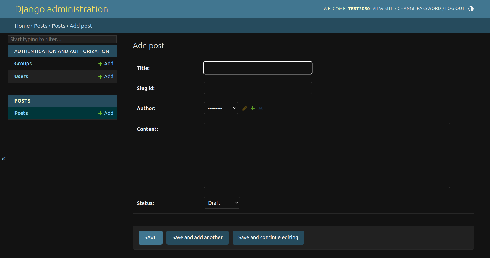

# Loqta2050 News Site

## Welcome

Welcome to **Loqta2050**, a dynamic and interactive news platform built using Django. Loqta2050 is designed to provide users with the ability to post, read, and comment on news articles, offering a community-driven space for discussion and engagement. Whether you want to stay up-to-date with the latest news, engage in discussions, or share your opinions, **Loqta2050** provides a user-friendly platform for a seamless experience.

[Here is the live version of the project](https://loqta2050-89fbbef45245.herokuapp.com/admin)

[Here is our E-commerce Website](https://loqta2050.com/)


## Purpose of the project

The goal of **Loqta2050** is to create a modern, Reddit-style news platform where users can share and discuss stories from around the world. By leveraging Django and PostgreSQL, this project aims to foster a community of contributors and readers, with features designed to enhance interaction, such as upvoting, commenting, and categorizing content by topics.

Whether you're a casual reader, an active participant, or a site admin, **Loqta2050** provides tools to create, manage, and engage with content in a meaningful way.


## User Stories:

### As a User:

1. I want to view news stories and comments on different topics so I can stay informed and engaged.
2. I want to register and log in to the platform so I can contribute by posting news stories and leaving comments.
3. I want to upvote or downvote posts so I can show my opinion on the content.
4. I want to filter posts by categories so I can quickly find stories that interest me.
5. I want to view the time and date of each post so I can know when the story was published.

### As an Admin:

1. I want to manage user posts and comments so I can moderate inappropriate content.
2. I want to manage categories so I can keep the content organized.
3. I want to view all user activities and ensure compliance with community guidelines.

## Features:

### Existing Features:

The **Loqta2050 News Site** offers several features to enhance user experience:

1. **User Registration and Authentication**: 
   Users can create accounts, log in, and log out securely. Once logged in, users can create and comment on posts.

2. **Post Creation and Voting**: 
   - Users can submit news stories on different topics.
   - Other users can upvote or downvote these posts based on their preferences.

   


    

3. **Commenting System**: 
   Users can comment on posts, fostering discussions on different news stories.
   
   

4. **Categorization**: 
   Posts are categorized by topics such as Politics, Technology, Entertainment, etc., allowing users to filter stories easily.

   

5. **Time and Date of Posting**: 
   Each post displays the date and time it was published to provide context to the news stories.
   
   

6. **User-friendly Interface**: 
   Loqta2050 provides a simple and intuitive interface for users to navigate posts, leave comments, and upvote/downvote stories.

7. **Admin Moderation Tools**: 
   Admin users have access to moderation tools, allowing them to approve, delete, or edit user content when necessary.

8. **Pagination for Posts**: 
   Users can browse through a paginated list of posts, making it easier to explore older news stories.

   


### Future Features:

1. **Private Messaging**: 
   Users will be able to send private messages to one another for more direct engagement.
   
2. **Multimedia Support**: 
   The ability for users to include images or videos in their posts to enhance the richness of shared content.
   
3. **Push Notifications**: 
   Users will receive notifications for upvotes, comments, and replies on their posts.
   
4. **Tagging System**: 
   Implement a tagging system for posts to enable better organization and searching across topics.

## Data Model:

This project uses Django’s Object-Relational Mapping (ORM) to handle data interactions between the application and PostgreSQL. The key models are as follows:

- **User**: Handles authentication and user profile information.
- **Post**: Represents a news article or story, including its title, content, author, category, and timestamp.
- **Comment**: Represents user comments on a post.
- **Category**: Represents a grouping or category of posts (e.g., Politics, Technology).
- **Vote**: Handles upvoting and downvoting of posts and comments.

The relational model ensures each post has associated comments, votes, and categories.


## Testing:

Manual testing was conducted by simulating common user behaviors, including:
- Creating posts and comments as a logged-in user.
- Upvoting and downvoting posts.
- Filtering posts by category.
- Ensuring valid inputs and error handling for invalid inputs (e.g., invalid post data, duplicate votes).

Automated unit tests were also written for core functionalities such as post creation, comment submission, and user authentication.

## Bugs:

### Solved Bugs:
- Pagination initially displayed incorrectly on smaller devices. This was fixed by adjusting the CSS for responsive behavior.
- An issue with user authentication when attempting to comment was resolved by properly linking the user session to the comment submission form.

### Remaining Bugs:
- Currently, no known bugs remain.

## Validator Testing:

All Python code has been validated using `flake8`, and the HTML has been tested using [W3C Markup Validator](https://validator.w3.org/). No major issues were found.


## Getting Started:

To set up **Loqta2050** locally for development or testing purposes, follow these steps:

1. Clone this repository to your local machine.
2. Create a virtual environment and install the dependencies using:
   ```
   pip install -r requirements.txt
   ```
3. Set up the PostgreSQL database and configure environment variables in `.env` (use `.env.example` for reference).
4. Run migrations:
   ```
   python manage.py migrate
   ```
5. Create a superuser:
   ```
   python manage.py createsuperuser
   ```
6. Start the Django development server:
   ```
   python manage.py runserver
   ```
7. Access the site locally at [http://localhost:8000](http://localhost:8000).

## Deployment:

This project can be deployed on platforms such as **Heroku** using the following steps:

1. Create a Heroku app and set the buildpacks to:
   1. `heroku/python`
   2. `heroku/nodejs` (if using front-end dependencies)
   
2. Set the required environment variables:
   - `DATABASE_URL`
   - `SECRET_KEY`
   - `DEBUG` (set to `False` in production)
   
3. Push your project to Heroku:
   ```
   git push heroku main
   ```
